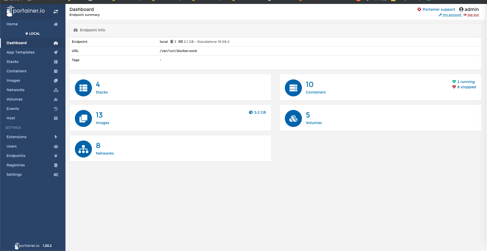

# 好用的 portainer.io

安裝
```bash
$ docker volume create portainer_data
$ docker run -d -p 9000:9000 --restart=always --name portainer -v /var/run/docker.sock:/var/run/docker.sock -v portainer_data:/data portainer/portainer
```

使用
